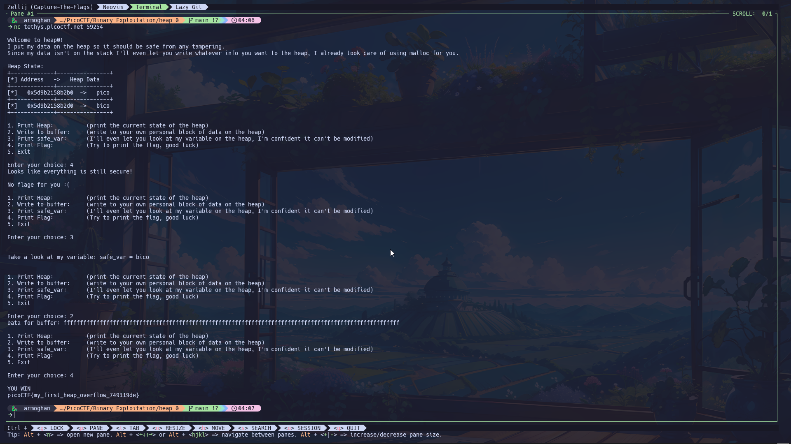

# heap 0 Challenge

**Author**: Abrxs, pr1or1tyQ

## Description

Are overflows just a stack concern?



## Challenge Files

You can download the challenge files here:

- [Download the binary](https://artifacts.picoctf.net/c_tethys/31/chall)
- [Download the source](https://artifacts.picoctf.net/c_tethys/31/chall.c)

Connect with the challenge instance here:

```bash
nc tethys.picoctf.net 59254
```

## How to Solve

The goal is to change the value of a variable called `safe_var`, which starts with the value `bico`. If we can change it to anything else, we’ll win and get the flag.

### Key Observations:
1. The source code gives us clues:
    - `safe_var` is stored on the heap and starts with the value `bico`.
    - The flag is revealed only if `safe_var` is modified.

2. We can modify memory on the heap:
    - There's a function called ``write_buffer()`` which lets us write data directly to memory.
    - The problem is that this function uses ``scanf()``, which doesn’t limit how much data we can input. That means we can overflow and modify memory we’re not supposed to!

### Strategy:
- By providing a long enough input to ``scanf()``, we can overwrite safe_var and change its value from "``bico``" to something else, like ``"pico"``.
- Since ``safe_var`` is stored right after the buffer we control, inputting a long string will flow into its memory and change its value.


## Tools You May Need

**Netcat**: To connect to the challenge (nc tethys.picoctf.net 59254).