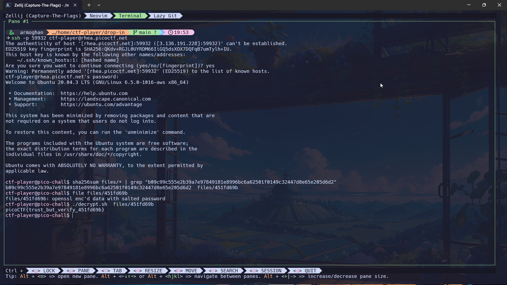

# Verify Challenge

**Author**: Jeffery John

## Description

In this challenge, participants must verify the authenticity of provided flags by checking their SHA-256 hashes. The goal is to ensure that players can identify the real flags and avoid being tricked by imitation flags.



## Challenge Files

You can download the challenge files here:

- [challenge.zip](https://artifacts.picoctf.net/c_rhea/23/challenge.zip)

### SSH Access

The same files are accessible via SSH:

```bash
ssh -p 51956 ctf-player@rhea.picoctf.net
```

- Password: `6abf4a82`
- **Note**: When entering the password in the terminal, it will be hidden. Type it carefully and press Enter.
- After connecting, accept the SSH fingerprint by typing `yes` and then use the `ls` command to list the files in the directory.

## Checksum

To ensure the integrity of the downloaded files, verify the SHA-256 checksum:

```bash
Checksum: b09c99c555e2b39a7e97849181e8996bc6a62501f0149c32447d8e65e205d6d2
```

You can verify the checksum using the following command (after navigating to the directory containing the challenge files):

```bash
sha256sum files/* | grep "b09c99c555e2b39a7e97849181e8996bc6a62501f0149c32447d8e65e205d6d2"
```

Ensure that the output matches the provided checksum.

## Decrypting Files

Once you've verified the hash, you can decrypt the files using the provided script. To do this, run:

```bash
./decrypt.sh files/<file>
```

Replace `<file>` with the name of the file you want to decrypt.

## Conclusion

This challenge tests your ability to verify file integrity using cryptographic hashes and decrypt files securely. Good luck, and remember to follow ethical guidelines while participating in CTF challenges!