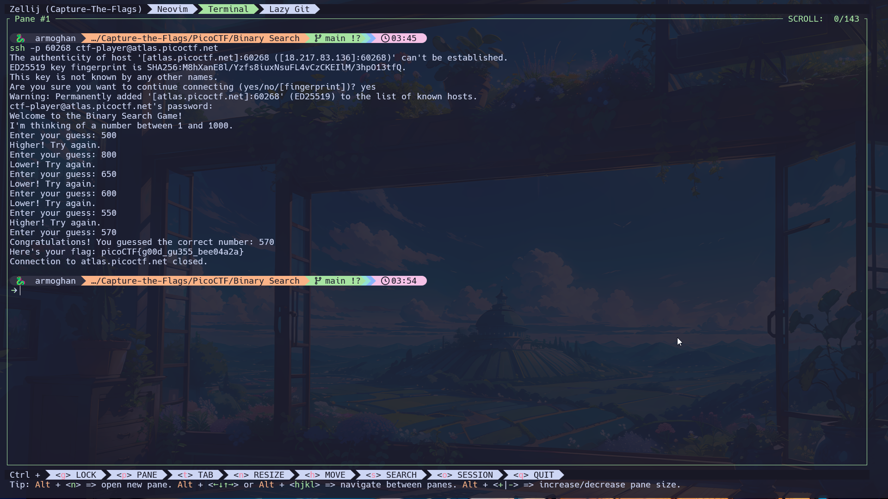

# Binary Search Challenge

**Author**: Jeffery John

## Description

Want to play a game? As you use more of the shell, you might be interested in how they work! Binary search is a classic algorithm used to quickly find an item in a sorted list. Can you find the flag? You'll have 1000 possibilities and only 10 guesses.

Cyber security often has a huge amount of data to look through - from logs, vulnerability reports, and forensics. Practicing the fundamentals manually might help you in the future when you have to write your own tools!

You can download the challenge files here:



## Challenge Files

You can download the challenge files here:

- [challenge.zip](https://artifacts.picoctf.net/c_atlas/20/challenge.zip)

### SSH Access

The same files are accessible via SSH:

```bash
ssh -p 60268 ctf-player@atlas.picoctf.net
```

- Password: `6abf4a82`
- **Note**: When entering the password in the terminal, it will be hidden. Type it carefully and press Enter.
- After connecting, accept the SSH fingerprint by typing `yes` and then use the `ls` command to list the files in the directory.

## How to Solve

1. **Run the shell script:**
  ```bash	
    chmod +x guessing_game.sh
    ./guessing_game.sh
  ```

2. **Binary Search Approach:**
 
- The script will prompt you to guess a number between 1 and 1000. You have 10 attempts to find the correct number using binary search.
- Binary search strategy: Always guess the middle of your current range to minimize guesses
  - Start by guessing 500 (middle of 1-1000).
  - If the correct answer is higher, guess halfway between 500 and 1000 (750).
  - If the answer is lower, guess halfway between 1 and 500 (250).
Repeat this process until you find the correct number.

3. **Extract the Flag:**

- Once you guess the correct number, the script will display the flag.
- The flag should follow the format picoCTF{...}.

## Tools You May Need

- **Bash shell**: If you’re on Windows, you can use WSL (Windows Subsystem for Linux) to run the shell script, or use a Linux system natively.
