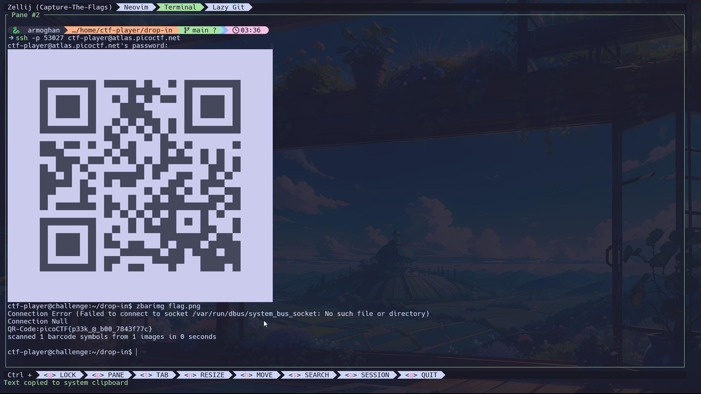

# Scan Surprise Challenge

**Author**: Jeffery John

## Description

I've gotten bored of handing out flags as text. Wouldn't it be cool if they were an image instead?
You can download the challenge files here:



## Challenge Files

You can download the challenge files here:

- [challenge.zip](https://artifacts.picoctf.net/c_atlas/16/challenge.zip)

### SSH Access

The same files are accessible via SSH:

```bash
ssh -p 53027 ctf-player@atlas.picoctf.net
```

- Password: `6abf4a82`
- **Note**: When entering the password in the terminal, it will be hidden. Type it carefully and press Enter.
- After connecting, accept the SSH fingerprint by typing `yes` and then use the `ls` command to list the files in the directory.

## How to Solve

1. **Scan the QR Code**:
   - Use a QR scanner on your phone: Just open your camera or a QR scanning app and scan the image.
      - **Use a command-line tool:**
        - You can use a tool like `zbarimg` to scan the QR code directly from the command line if you are on Linux. Install it using:
            ```bash
            sudo apt-get install zbar-tools
            ```
        - Then scan the image with the following command:
            ```bash
            zbarimg  flag.png
            ```
   
2. **Extract the Flag**:
   - Once you scan the QR code, it should reveal the flag or provide a clue to retrieve the flag.

## Tools You May Need

- **QR Code Scanners**: You can use your phone or online tools such as:
    - Mobile: Use a QR scanning app or your phone’s camera.
    - Linux: Use the zbarimg tool or similar QR code scanning utilities
      - [ZXing Decoder Online](https://zxing.org/w/decode.jspx)
      - [QR Code Reader](https://webqr.com/)
